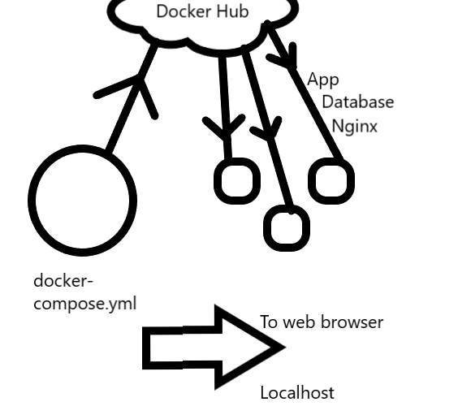

# Docker compose



First create a docker-compose.yml file:

Next write the code to deploy the app image from your docker hub in your docker-compose.yml file:

the code is as follows:

```
# Deploy database
---
version: '3.1'

services:
  database:
    image: shaleka/tech230-database:v1
    restart: always
    ports:
      - 27017:27017
```

```
# Deploy app

  sparta-app:
    image: shaleka/tech230-sparta-app:v1
    restart: always
    ports:
      - 3000:3000
    depends_on:
      - database
    environment:
      - DB_HOST=database:27017/posts
    command: >
      sh -c "npm install && npm start"
```

Run ```$ docker-compose up -d```

you should see this:

[label](docker-compose.md)

If it all works, in the web browser you should see your app on :3000 and posts on :3000/posts:


