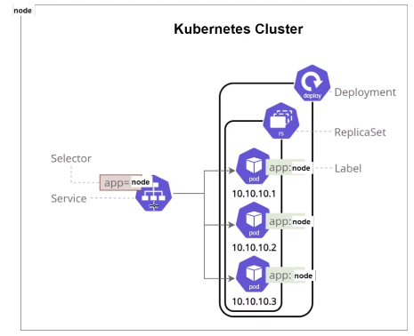
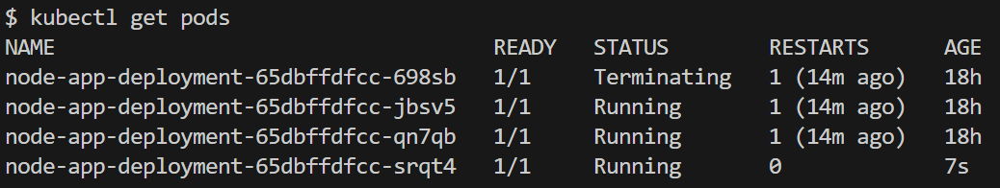
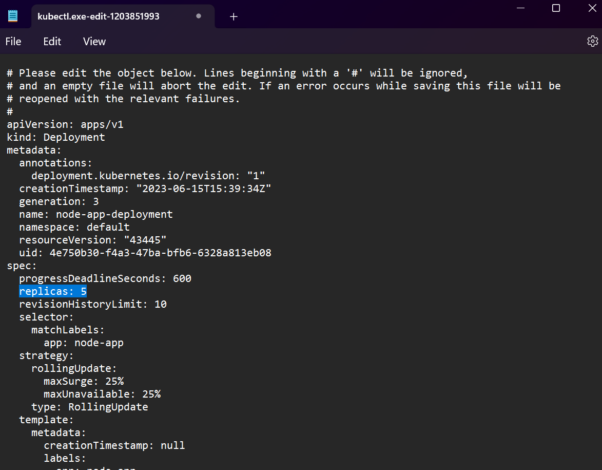
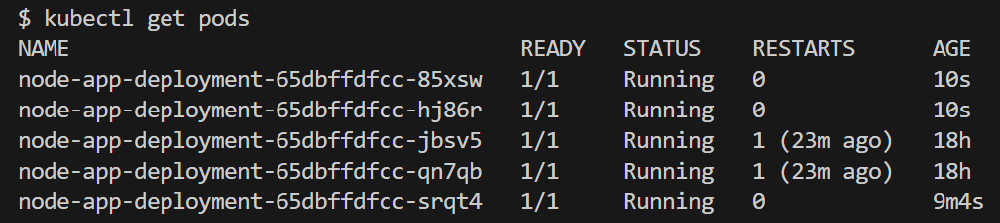

### Create the app deploy file

Firstly, create a YAML file for the deployment of the app as shown below. This Deployment will create and manage Pods with the label app: node-app, running the specified NodeJS application image on port 3000. The Deployment will ensure that there are always 3 replicas of the Pods running.

```
apiVersion: apps/v1 # Specifies the API version to use
kind: Deployment # Specifies the kind of object to create, in this case, a Deployment                         
metadata:
  name: node-deployment # The name of the Deployment                 
spec:
  selector:
    matchLabels:
      app: node-app # Selects Pods with labels matching "app: node-app"
  replicas: 3 # Creates a replica set with 3 instances/pods                        
  template: # Specifies the template for creating Pods                               
    metadata:
      labels:
        app: node-app # The labels for the Pods created from this template                       
    spec:
      containers: # Specifies the containers to run in the Pod                     
      - name: node-app # The name of the container                     
        image: shaleka/tech230-sparta-app:v2 # The image to use for the container
        ports:
        - containerPort: 3000 # Specifies the port to expose on the container
        env: # Creating an Environment variable for connecting to MongoDB
        - name: DB_HOST
          value: "mongodb://mongo-db-svc:27017/posts"
```

Next deploy the pod using ```kubectl create -f node-deploy.yaml``` or the name of your deployment file.

To check the Deployment and the running Pods in your cluster use the following commands: ```kubectl get pods```


### Creating the app service file

The next step is to create the YAML code to define a Kubernetes Service in the default namespace. It exposes a set of Pods labeled app: node-app on port 80. The Service is of type NodePort, and it listens on port 30001 on each node in the cluster, forwarding traffic to port 3000 on the Pods running the app.

```
apiVersion: v1 # Specifies the API version to use
kind: Service # Specifies the kind of object to create, in this case, a Service                         
metadata:
  name: node-svc # The name of the Service
  namespace: default # Specifies the namespace in which the Service should be created                 
spec:
  ports:
  - nodePort: 30001 # Specifies nodePort for Service (range: 30000-32768)
    port: 80 # The port on which the Service will listen
    targetPort: 3000 # The port on the Pods to which the Service will forward traffic
  selector:
    app: node-app # Selects Pods with labels matching "app: node-app"
  type: NodePort # Specifies the type of Service, in this case, NodePort
  ```

Next create the service using : ```kubectl create -f node-service.yaml```

to check it: ```kubectl get svc```

  

### Creating a DB deployment

In a similar way to create the App Deployment, we can create the Database Deployment, as shown below, where we specified the container port as 27017 which is the default port on the MongoDB service.

```
apiVersion: apps/v1 # Specifies the API version to use
kind: Deployment # Specifies the kind of object to create, in this case, a Deployment                         
metadata:
  name: mongo-deployment # The name of the Deployment                 
spec:
  selector:
    matchLabels:
      app: mongo-app # Selects Pods with labels matching "app: nginx"
  replicas: 3 # Creates a replica set with 3 instances/pods                        
  template: # Specifies the template for creating Pods                               
    metadata:
      labels:
        app: mongo-app # The labels for the Pods created from this template                 
    spec:
      containers: # Specifies the containers to run in the Pod                     
      - name: mongo # The name of the container                     
        image: shaleka/tech230-database:v2 # The image to use for the container
        ports:
        - containerPort: 27017 # Specifies the port to expose on the container
```

Deploy the pod: ```kubectl create -f mongo-deploy.yaml```

To check it: ```kubectl get deply```

To check pods ```kubectl get pods```

### Creating the db serivce

n a similar way to create the App Service, we can create the Database Service, as shown below, where we specified the container port as 27017 which is the default port on the MongoDB service.

```
apiVersion: v1 # Specifies the API version to use
kind: Service # Specifies the kind of object to create, in this case, a Service                         
metadata:
  name: mongo-svc # The name of the Service
  namespace: default # Specifies the namespace in which the Service should be created                 
spec:
  ports:
  - nodePort: 30002 # Specifies nodePort for Service (range: 30000-32768)
    port: 27017 # The port on which the Service will listen
    targetPort: 27017 # The port on the Pods to which the Service will forward traffic
  selector:
    app: mongo-app # Selects Pods with labels matching "app: "
  type: NodePort # Specifies the type of Service, in this case, NodePort
```

```kubectl create -f mongodb-service,yaml```

### Self heailing using k8

f a Pod gets destroyed or it goes down, K8s will automatically create a new one in its place to meet the replica count. You can try and delete a pod using the following command:

```kubectl delete pod <pod-name>```

Now, when we get the pod information, one is automatically running even before the old pod has finished being terminated:

```kubectl get pods```



### Scalibility on k8

We can easily scale the pods with zero-downtime by editing the configuration file using the following command:

```kubectl edit deploy <deployment-name>```



Now, when we get the pod information, we can see 5 pods are running instead of the previous amount of 3. If we was to refresh the web application during this time, we would also see zero-downtime.

```kubectl get pods```


.