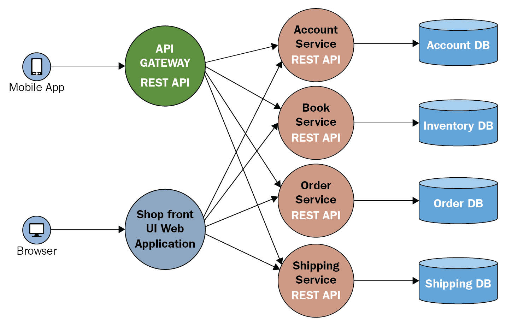

# What is a Micro Services Architecture?  

### What are the use cases?

Microservices architecture is an architectural style that structures an application as a collection of small, loosely coupled, and independently deployable services. In a microservices architecture, the application is divided into a set of self-contained services that are responsible for specific business capabilities. Each service can be developed, deployed, and scaled independently of the others.

Here are some key characteristics of microservices architecture:

1.	Service Independence: Each microservice is responsible for a specific business capability and can be developed, deployed, and scaled independently. This allows teams to work on different services concurrently and deploy updates without affecting the entire application.

2.	Loose Coupling: Microservices communicate with each other through well-defined APIs, often using lightweight protocols like HTTP or messaging queues. This loose coupling allows each service to be developed and maintained independently, enabling flexibility and agility.

3.	Scalability: Microservices can be individually scaled based on demand. Services experiencing high traffic or resource requirements can be scaled up independently, ensuring efficient resource utilisation.

4.	Resilience: Failure of one microservice does not impact the entire application. Each service can be designed to be resilient and fault-tolerant, enabling the system to continue functioning even if some services are unavailable.

5.	Technology Diversity: Microservices architecture allows different services to be built using different technologies and programming languages. This flexibility enables teams to choose the best technology stack for each service, based on its specific requirements.

Use cases for microservices architecture include:

1.	Large-scale applications: Microservices architecture is well-suited for complex applications with multiple business domains, where different teams can work on different services independently.

2.	Continuous Deployment: Microservices enable continuous integration and deployment practices. Since each service can be developed and deployed independently, updates and new features can be released frequently without disrupting the entire application.

3.	Scalability: Microservices architecture allows scaling individual services based on demand, which is beneficial for applications experiencing varying levels of traffic or resource requirements.

4.	Flexibility and Innovation: Microservices architecture enables teams to innovate and experiment more freely. Different services can be developed using different technologies, allowing teams to choose the best tools for the job.

5.	Evolvability and Maintainability: With microservices, it's easier to modify and extend individual services without impacting the entire application. This promotes evolvability and maintainability, as updates can be made to specific services without requiring a full system overhaul.

It's important to note that while microservices offer several benefits, they also introduce additional complexity in terms of inter-service communication, data consistency, and deployment management. Organisations should carefully evaluate their specific requirements and consider the trade-offs before adopting microservices architecture.

### Who is using it in the industry?

Microservices architecture has gained popularity and is being adopted by various organizations across different industries. Here are some notable companies that have embraced microservices architecture:

1.	Netflix: Netflix is known for its microservices-based architecture. They have a highly distributed system where each microservice handles a specific functionality, such as user recommendations, content delivery, and billing. This architecture allows Netflix to scale their services independently and continuously release new features.

2.	Amazon: Amazon has been using microservices for many of its services, such as Amazon Prime, Amazon Web Services (AWS), and Amazon Go. The company's microservices architecture enables them to handle massive scale and deliver a seamless customer experience.

3.	Uber: Uber's platform is built on microservices architecture, allowing them to handle millions of ride requests and support various features like real-time tracking, payments, and driver management. The decoupled nature of microservices enables Uber to iterate and scale different parts of their system independently.

4.	Spotify: Spotify uses microservices to power its music streaming platform. They have organized their services around specific functionalities like user authentication, playlist management, recommendations, and content delivery. This architecture helps Spotify maintain agility and deliver personalized experiences to their users.

5.	Google: Google leverages microservices architecture extensively across its various services, including Gmail, Google Drive, and Google Maps. Microservices enable Google to handle high traffic loads, scale their services independently, and continuously innovate.

6.	Twitter: Twitter has adopted a microservices-based approach to improve scalability and reliability. By decomposing their system into smaller services, Twitter can handle the enormous volume of tweets, notifications, and user interactions efficiently.

7.	Airbnb: Airbnb has embraced microservices architecture to power its online marketplace for accommodations. Each service handles a specific domain, such as search, bookings, reviews, and payments, allowing Airbnb to scale and evolve different parts of their platform independently.

### Why should we use it?

There are several reasons why organisations choose to adopt microservices architecture:

1.	Scalability: Microservices architecture allows for independent scaling of individual services based on demand. This means that organizations can allocate resources specifically to the services that require them, rather than scaling the entire application. This flexibility in scaling helps improve performance and handle varying levels of traffic efficiently.

2.	Agility and Flexibility: Microservices enable teams to work independently on different services, promoting agility and faster development cycles. Teams can choose the most suitable technology stack and development practices for each service, allowing for greater flexibility in implementation and innovation.

3.	Fault Isolation: In a monolithic architecture, a single failure can bring down the entire application. In contrast, microservices architecture ensures fault isolation. If one service fails, it doesn't necessarily impact the entire system, as other services can continue to function independently. This improves system resilience and overall availability.

4.	Easier Maintenance and Evolvability: Microservices architecture makes it easier to update and maintain individual services without disrupting the entire application. Each service has its own codebase and can be independently deployed and tested, reducing the risks associated with making changes. This modularity facilitates faster bug fixes, feature updates, and overall system evolution.

5.	Technology Diversity: Microservices architecture allows organisations to adopt different technologies and programming languages for different services. This flexibility enables teams to choose the most appropriate tools for each service's specific requirements. For example, one service may be developed using Node.js, while another may use Python or Java.

6.	Team Scalability and Autonomy: Microservices architecture promotes team autonomy and scalability. Different teams can work on different services concurrently, using their own development and deployment processes. This decentralised approach enables organisations to scale their development efforts efficiently and avoid bottlenecks.

7.	Reusability and Modularity: Microservices encourage a modular approach to software development. Services can be designed to be reusable, with well-defined APIs, enabling them to be easily integrated into other applications or used by other services within the organization. This promotes code reusability and accelerates development efforts.

8.	Cloud-Native and DevOps Practices: Microservices architecture aligns well with cloud-native and DevOps practices. It allows organisations to take advantage of cloud platforms, containerisation, and orchestration tools like Kubernetes, enabling efficient deployment, scaling, and management of services.

### When should we not use it?

While microservices architecture offers many advantages, it may not be suitable for every situation. Here are some scenarios where adopting microservices architecture may not be the best choice:

1.	Small or Simple Applications: If you have a small or relatively simple application with a limited number of functionalities, adopting microservices architecture may introduce unnecessary complexity. The overhead of managing multiple services and inter-service communication may outweigh the benefits in such cases.

2.	Limited Development Resources: Microservices architecture requires dedicated teams to develop, deploy, and maintain each service. If you have limited development resources or a small team, it may be challenging to manage and support multiple services effectively.

3.	Tight Coupling of Business Logic: If your application has tightly coupled business logic, where changes in one module often require corresponding changes in other modules, implementing microservices may add complexity without significant benefits. In such cases, a monolithic architecture might be more suitable.

4.	Limited Scalability Needs: If your application doesn't anticipate significant fluctuations in traffic or resource requirements, the scalability benefits of microservices may not be crucial. A monolithic architecture can often handle moderate scaling needs efficiently.

5.	Legacy Systems: If you have a legacy application that is not designed with microservices in mind, migrating to a microservices architecture can be challenging and may require significant refactoring. In such cases, it might be more practical to improve and modernise the existing monolithic application.

6.	High Inter-Service Communication Overhead: Microservices rely heavily on inter-service communication, often using APIs or message queues. If the services need to communicate frequently or exchange large amounts of data, the performance and network latency associated with inter-service communication can become a bottleneck.

7.	Organisational Readiness and Expertise: Adopting microservices architecture requires a certain level of organisational readiness and expertise. It involves establishing proper service governance, deployment pipelines, monitoring, and observability practices. If your organisation lacks the necessary skills and experience, it can be challenging to successfully implement and maintain a microservices architecture.

8.	Tight Budget and Cost Constraints: Implementing and managing a microservices architecture can be resource-intensive. It may require additional infrastructure, tooling, and operational overhead. If you have tight budget constraints, it might be more cost-effective to stick with a simpler architecture.

It's important to carefully assess your specific requirements, project scope, team capabilities, and constraints before deciding whether or not to adopt microservices architecture. Consider the trade-offs, complexity, and long-term implications to make an informed decision. In some cases, a hybrid approach or gradual transition to microservices may be more suitable.

### The diference between microservices architecture, monalinth and 2 tier

Microservices architecture, monolithic architecture, and two-tier architecture are three different approaches to designing software applications. Here's a comparison of these architectures:

Microservices Architecture:

•	In microservices architecture, the application is decomposed into a collection of small, independent services that communicate with each other through APIs or messaging.

•	Each microservice focuses on a specific business capability and can be developed, deployed, and scaled independently.

•	Microservices are loosely coupled and can be built using different technologies and programming languages.

•	This architecture promotes flexibility, scalability, fault isolation, and faster development cycles. It is well-suited for complex applications and large development teams.

Monolithic Architecture:
•	In a monolithic architecture, the entire application is developed and deployed as a single, self-contained unit.

•	All functionalities and components of the application are tightly coupled and run in the same process or on the same server.

•	Monolithic applications often have a layered architecture, with the user interface, business logic, and data access layers bundled together.

•	This architecture is simpler to develop and deploy initially, but as the application grows, it can become harder to maintain, scale, and update. Modifying one part of the application often requires redeploying the entire monolith.

Two-Tier Architecture:

•	Two-tier architecture, also known as client-server architecture, divides the application into two main layers: the client and the server.

•	The client layer represents the user interface or presentation layer, while the server layer handles the business logic and data access.

•	The communication between the client and server typically happens over a network, with the client making requests to the server and receiving responses.

•	This architecture is often used for simple applications where the client interacts directly with the server for data processing and storage. It doesn't provide the same level of decoupling and scalability 
as microservices architecture.

Here are some key differences among these architectures:

1.	Modularity: Microservices architecture is highly modular, with services independently developed and deployed. Monolithic architecture is a single, tightly coupled unit. Two-tier architecture has two main layers, but they are not as independent or modular as microservices.

2.	Scalability: Microservices architecture allows individual services to be scaled independently based on demand. Monolithic applications scale as a whole. Two-tier architecture doesn't provide the same scalability options as microservices.

3.	Deployment: Microservices can be individually deployed and updated without affecting the entire application. Monolithic applications require deploying the entire application together. Two-tier architecture typically involves deploying the client and server components together.

4.	Communication: In microservices architecture, services communicate through APIs or messaging. Monolithic applications often have direct method invocations between components. Two-tier architecture involves network-based communication between the client and server.

5.	Complexity: Microservices architecture introduces additional complexity due to distributed systems and inter-service communication. Monolithic applications are simpler to develop and deploy initially. Two-tier architecture is relatively simple but may lack the flexibility and scalability of microservices.

The choice of architecture depends on various factors, including the application's size, complexity, scalability needs, team structure, and deployment environment. Each architecture has its strengths and trade-offs, and the decision should be based on careful consideration of the specific project requirements.

### What is Docker?

Docker is an open-source platform that allows you to automate the deployment, scaling, and management of applications using containeriSation. It provides an isolated environment called a container that packages an application and its dependencies together, ensuring consistent behavior across different computing environments.

Here are some key aspects of Docker:

Containerisation: Docker enables the creation and management of containers. A container is a lightweight, standalone, and executable package that contains everything needed to run an application, including code, runtime, system tools, libraries, and settings. Containers are isolated from each other and from the underlying host system, ensuring that applications run consistently across different environments.

Image-based Approach: Docker uses a layered image-based approach for container creation. An image is a read-only template that contains the instructions for creating a container. Images are built using a Dockerfile, which specifies the application's dependencies, configuration, and other details. Images can be stored and versioned in Docker registries, such as Docker Hub.

Portability: Docker provides a high level of portability. Containers can run on any system that has Docker installed, regardless of the underlying operating system or infrastructure. This portability enables easy migration and deployment of applications across different environments, such as development, testing, and production.

Efficiency: Docker containers are lightweight and share the host system's operating system kernel. This makes them more efficient in terms of resource usage compared to traditional virtual machines (VMs). Multiple containers can run on a single host, each with its own isolated environment, providing better resource utilisation.

Scalability: Docker simplifies the process of scaling applications. By using containerisation, you can easily replicate and run multiple instances of the same container on different hosts or within a cluster. This allows applications to scale horizontally, handling increased traffic and demand.

Orchestration: Docker provides tools like Docker Swarm and Kubernetes that enable orchestration and management of containerised applications across multiple hosts or a cluster. These tools help with load balancing, service discovery, scaling, and automated deployment of containers.

DevOps Integration: Docker is widely used in DevOps practices due to its ability to create reproducible environments and simplify the deployment process. It enables teams to package applications and their dependencies into containers, ensuring consistency from development to production. Docker integrates well with popular DevOps tools and workflows.

Docker has become immensely popular for its ability to streamline application deployment, improve software delivery speed, and enhance scalability and portability. It has revolutionized the way applications are packaged, deployed, and managed, making it easier to build and run software in diverse computing environments.

### What are the use cases?

Docker has a wide range of use cases across different industries and application types. Here are some common use cases for Docker:

1. Application Deployment and Packaging: Docker simplifies the packaging and deployment of applications. It allows you to package an application and its dependencies into a container, ensuring consistency and portability across different environments. This makes it easier to deploy applications consistently across development, testing, and production environments.

2. Microservices Architecture: Docker is often used in the context of microservices architecture. Each microservice can be packaged and deployed as a separate container, allowing for independent scaling, deployment, and management of individual services. Docker facilitates the decoupling of services and enables teams to develop and deploy microservices-based applications more efficiently.

3. Continuous Integration and Continuous Deployment (CI/CD): Docker integrates well with CI/CD workflows. By packaging applications into containers, Docker enables consistent builds and deployment processes. Containers can be built and tested in isolated environments, ensuring that applications work as expected before being deployed. Docker also allows for rapid rollbacks in case of issues, promoting faster iterations and continuous delivery.

4. Hybrid and Multi-Cloud Deployments: Docker's portability makes it ideal for hybrid and multi-cloud deployments. Containers can be built and deployed across different cloud providers or on-premises environments. This flexibility allows organisations to avoid vendor lock-in, easily migrate applications between different environments, and take advantage of the benefits offered by different cloud providers.

5. Development and Testing Environments: Docker simplifies the setup of development and testing environments. Developers can package the necessary dependencies and tools into containers, ensuring consistent environments across the development team. Testing teams can create isolated environments for testing applications, without worrying about conflicting dependencies or setup inconsistencies.

6. Scalable and Resilient Applications: Docker's containerisation enables horizontal scaling of applications. Containers can be easily replicated and deployed across multiple hosts or a cluster, allowing applications to handle increased traffic and demand. Docker also helps in building resilient applications by isolating services and enabling fault tolerance through container restarts or migrations.

7. Legacy Application Modernisation: Docker can be used to modernise and containerise legacy applications. By encapsulating legacy applications into containers, organisations can benefit from the portability, scalability, and ease of deployment provided by Docker. This approach allows for gradual modernisation without requiring a complete rewrite of the application.

8. Internet of Things (IoT) Deployments: Docker's lightweight and efficient containers make it suitable for IoT deployments. Containers can be deployed on edge devices or gateways, enabling local processing and reducing bandwidth requirements. Docker's orchestration tools like Docker Swarm or Kubernetes can be used to manage and scale containerized IoT applications.

These are just a few examples of Docker use cases. The versatility and flexibility of Docker make it applicable to a wide range of scenarios, enabling organizations to improve software development processes, enhance deployment agility, and build scalable and portable applications.
